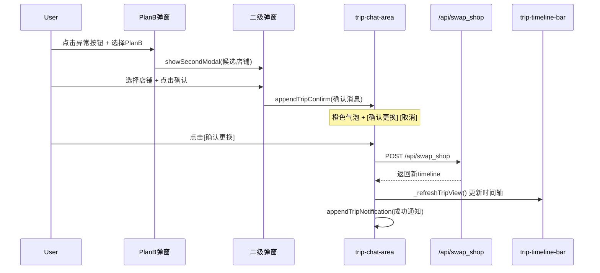

# Design Document

## Overview
本设计定义美团AI管家虚拟控制台四项交互优化的技术架构。改动集中在 `index.html`（前端UI/交互逻辑）和 `server.py`（一个API端点重写）。所有新增组件复用现有基础设施（Web Audio、AmapPOIClient、renderMetroTimelineForMainFace）。

**Users**: 沙盒测试用户（通过虚拟控制台注入异常并观察PlanB响应）
**Impact**: 修改异常按钮交互、PlanB推荐数据源、换店确认流程、弹窗通知音效

### Goals
- 异常按钮支持激活/取消红框toggle，激活异常chip可见
- 暴雨避雨推荐使用高德实时API，带降级策略
- 换店/排号操作须经用户显式确认后方可执行
- 异常PlanB弹窗伴随响铃提示

### Non-Goals
- 不修改后端排程算法
- 不新增异常类型
- 不改变提醒模块行为
- 不修改地图面板

## Boundary Commitments

### This Spec Owns
- 异常按钮的激活态CSS class切换逻辑（`border-red-500` / `border-gray-700`）
- `activeExceptions` 数组与按钮视觉状态的双向同步
- `#active-exceptions-list` DOM容器的创建与chip渲染
- `/api/get_nearby_cafes` 端点的数据源策略（实时API优先 → 缓存降级）
- 换店操作的用户确认交互流程（`appendTripConfirm` 消息 → 用户点击 → API调用）
- 行程通知消息的渲染（`appendTripNotification` 写入 `#trip-chat-area`）
- PlanB弹窗打开时的响铃触发

### Out of Boundary
- `#exec-cover` / `#exec-card` / `#exec-plan-content` 的创建或修复（决定不创建这些缺失DOM，改用 `#trip-chat-area`）
- 提醒模块（`reminder-dialog`, `_medContinuousRing`）的行为变更
- AmapPOIClient 本身的方法签名或缓存策略

### Allowed Dependencies
- `_playNotificationSound()` — 现有Web Audio通知音效函数
- `AmapPOIClient.search_nearby()` — 现有高德POI附近搜索方法
- `renderMetroTimelineForMainFace()` — 现有水平时间轴渲染
- `_refreshTripView()` — 现有行程视图刷新
- `showSecondModal()` / `confirmSecondModal()` — 现有二级弹窗机制
- `renderActiveExceptions()` / `removeActiveException()` — 现有异常chip管理
- `activeExceptions` 数组 — 现有异常状态存储

### Revalidation Triggers
- `_playNotificationSound` 函数签名变更
- `AmapPOIClient.search_nearby` 返回格式变更
- `#trip-chat-area` DOM ID 变更
- `_refreshTripView` 行为变更

## Architecture

### Existing Architecture Analysis
项目为单页HTML应用（~6852行 `index.html`） + Python Flask后端（`server.py`）。前端无模块化构建，所有JS逻辑内联在 `<script>` 标签中。交互模式为：按钮 → 全局函数 → DOM操作 / fetch API调用。后端为 Flask route handler → Agent skill 调用模式。

本feature遵循现有架构模式：所有新增JS函数以内联方式添加到 `index.html` 的 `<script>` 区域，API改动限定在 `server.py` 的现有路由函数内。

### Architecture Pattern & Boundary Map

```mermaid
graph TB
    User[用户点击异常按钮]
    User --> LeftPanel[左侧面板: 异常按钮]
    User --> Modal[PlanB弹窗]
    
    LeftPanel --> Toggle[updateAnomalyButtonState]
    LeftPanel --> ChipList[active-exceptions-list]
    
    Modal --> Ring[_playNotificationSound]
    Modal --> PlanBOptions[PlanB方案选择]
    
    PlanBOptions --> FindShelter[find_shelter: 高德API]
    PlanBOptions --> SwapShop[swap_shop: 确认流程]
    
    FindShelter --> AmapAPI[AmapPOIClient.search_nearby]
    AmapAPI --> SecondModal[二级弹窗: 店铺选择]
    
    SwapShop --> SecondModal
    SecondModal --> TripConfirm[appendTripConfirm: 确认消息]
    TripConfirm --> SwapAPI[/api/swap_shop]
    TripConfirm --> RefreshView[_refreshTripView]
    
    SwapAPI --> RefreshView
    RefreshView --> TimelineBar[trip-timeline-bar]
    RefreshView --> TripChat[trip-chat-area 通知消息]
```

**Key decisions**:
- 按钮toggle使用 `activeExceptions` 数组作为唯一真实源，按钮状态为派生视图
- 确认消息使用 `#trip-chat-area`（已存在）而非修复 `#exec-cover`（需复杂DOM注入）
- 高德API调用绕过 `search_poi_matrix` 的预缓存拦截，直接调用 `search_nearby`

## File Structure Plan

### Modified Files
- `index.html` — 所有前端改动：按钮id、toggle函数、通知/确认函数、swap/find_shelter分支改写、响铃触发、active-exceptions-list容器
- `server.py` — `/api/get_nearby_cafes` 端点重写（~1764-1835行），直调高德API

### Unchanged Files
- `skills/amap_poi/amap_poi.py` — 仅引用现有 `search_nearby()`，无修改
- `static/js/chat-core.js`, `static/js/chat-ui.js` — 无关联

## System Flows

### Swap Shop Confirmation Flow



## Requirements Traceability

| Req | Summary | Components | Interfaces | Flows |
|-----|---------|------------|------------|-------|
| 1.1 | 点击未激活按钮→红框+弹窗 | `updateAnomalyButtonState`, `triggerDemoException` | CSS class toggle | 按钮click → toggle检查 → 红框/弹窗 |
| 1.2 | 再次点击→取消红框+取消异常 | `updateAnomalyButtonState`, `removeActiveException` | CSS class toggle | 按钮click → toggle检查 → 取消 |
| 1.3 | 多异常独立红框状态 | `_anomalyButtonMap`, `updateAnomalyButtonState` | 4按钮独立id | 每个按钮独立toggle |
| 1.4 | 异常取消同步移除红框 | `removeActiveException` | `updateAnomalyButtonState(type, false)` | chip点击 → remove → 按钮还原 |
| 1.5 | 激活异常chip列表 | `renderActiveExceptions`, `#active-exceptions-list` | DOM容器 | push → render → chip可见 |
| 2.1 | 高德API实时查询 | `/api/get_nearby_cafes` | `AmapPOIClient.search_nearby()` | fetch → API → 最近饮品店 |
| 2.2 | 展示店名评分距离 | `find_shelter`分支 → `showSecondModal` | nearest对象字段 | API响应 → 弹窗渲染 |
| 2.3 | 三种操作选项 | 二级弹窗3选项 | shelter/taxi/cancel callback | 用户选择 → 对应action |
| 2.4 | API不可用降级 | `/api/get_nearby_cafes` fallback | `poi_cache` | API异常 → cache → source字段 |
| 2.5 | 避雨前确认 | `appendTripConfirm` | confirm callback | 选店 → 确认消息 → 执行 |
| 3.1 | 选店后展示确认消息 | `appendTripConfirm` | 橙色气泡+按钮 | SecondModal确认 → Chat确认 |
| 3.2 | 确认后执行+更新时间轴 | `_refreshTripView` | `renderMetroTimelineForMainFace` | API成功 → 时间轴刷新 |
| 3.3 | 取消后不执行 | `appendTripConfirm` cancel回调 | 取消通知 | 用户取消 → 无API调用 |
| 3.4 | 不弹深色行程卡片 | swap分支改写 | 移除`renderSchedule()`调用 | 仅`_refreshTripView()` |
| 3.5 | 异常解除恢复通知 | `removeActiveException` → `appendTripNotification` | trip-chat-area消息 | 异常移除 → 恢复通知 |
| 4.1 | 弹窗时播放提示音 | `triggerDemoException` → `_playNotificationSound` | Web Audio API | modal显示 → 响铃 |
| 4.2 | 关闭弹窗不重复响铃 | 仅在modal.classList.remove('hidden')后触发一次 | N/A | 单次调用 |
| 4.3 | 与提醒模块同音效 | 复用 `_playNotificationSound` | Web Audio双音叮咚 | N/A |

## Components and Interfaces

### UI Layer: 异常按钮状态管理

#### `updateAnomalyButtonState(type, isActive)`
| Field | Detail |
|-------|--------|
| Intent | 切换指定异常按钮的红框激活态 |
| Requirements | 1.1, 1.2, 1.3, 1.4 |

**Responsibilities & Constraints**
- 通过 `_anomalyButtonMap` 将异常type映射到按钮DOM id
- isActive=true → 添加 `border-red-500 bg-red-900/30`，移除 `border-gray-700`
- isActive=false → 反向操作
- 仅处理4种已知异常类型，未知类型静默忽略

**Dependencies**
- Outbound: `activeExceptions` 数组 (P0) — 不直接读取，仅做视觉同步
- Outbound: 4个按钮DOM元素 (P0) — 通过 `getElementById` 访问

**Implementation Notes**
- 在 `triggerDemoException` 前定义，以便toggle逻辑引用
- 所有 `executePlanB` 中 `activeExceptions.push` 后调用

### UI Layer: 行程通知与确认

#### `appendTripNotification(text)`
| Field | Detail |
|-------|--------|
| Intent | 在行程聊天区渲染蓝色通知气泡 |
| Requirements | 3.2, 3.3, 3.5 |

**Responsibilities & Constraints**
- 目标容器: `#trip-chat-area`
- 若容器不存在且 `lastScheduleData` 有效，先调用 `_refreshTripView()` 创建
- 消息样式: `bg-blue-50 border border-blue-200 rounded-2xl p-3`
- 自动滚动到底部

**Dependencies**
- Inbound: `lastScheduleData` (P1) — 用于fallback创建chat area
- Outbound: `_refreshTripView` (P1) — fallback时调用

#### `appendTripConfirm(text, onConfirm, onCancel)`
| Field | Detail |
|-------|--------|
| Intent | 渲染带确认/取消按钮的橙色询问消息，用户必须点击确认才执行操作 |
| Requirements | 2.5, 3.1, 3.2, 3.3 |

**Service Interface**
```javascript
function appendTripConfirm(
  text: string,           // 确认消息HTML内容
  onConfirm: (done: () => void) => void,  // 确认回调，done()移除消息
  onCancel: () => void     // 取消回调
): void
```
- Preconditions: `#trip-chat-area` 存在或可通过 `_refreshTripView()` 创建
- Postconditions: 消息渲染在chat area底部，按钮绑定一次性事件
- Invariants: `resolved` 标志防止重复触发

**Dependencies**
- Outbound: `#trip-chat-area` (P0) — 消息容器
- Outbound: `_refreshTripView` (P1) — fallback创建

**Implementation Notes**
- 确认按钮执行中状态: "执行中..." + 禁用
- 取消按钮: 消息半透明 + 1.5s后自动移除
- 使用闭包 `resolved` 标志防止重复点击

### Backend Layer: 饮品店实时查询

#### `/api/get_nearby_cafes` (重写)
| Field | Detail |
|-------|--------|
| Intent | 实时查询用户附近饮品店，优先高德API，降级缓存 |
| Requirements | 2.1, 2.2, 2.4 |

**API Contract**
| Method | Endpoint | Request | Response | Errors |
|--------|----------|---------|----------|--------|
| POST | /api/get_nearby_cafes | `{lat?: number, lng?: number}` | `{shops: Shop[], source: string, total_found: number}` | 500 (API异常→降级) |

**Shop Object**:
```python
{
  "shop_id": str,
  "name": str,
  "rating": float,
  "distance": str,        # "800m" or "1.2km"
  "distance_meters": int,
  "coord": str            # "lat,lng"
}
```

**Responsibilities & Constraints**
- 坐标优先级: 请求body → session_state.spatial_matrix → 北京中心 (39.93, 116.45)
- 直接调用 `AmapPOIClient.search_nearby(lng, lat, radius=3000, keywords="咖啡|奶茶|茶饮", category="cafe")`
- Haversine公式计算每个店铺距离
- API无结果时fallback到 `agent.poi_cache` 中 `category=="cafe"` 的店铺
- 响应含 `source` 字段标识数据来源

**Dependencies**
- External: `AmapPOIClient.search_nearby` (P0) — 高德API
- Outbound: `agent.poi_cache` (P1) — 降级数据源
- Outbound: `session_state` (P1) — 坐标提取

**Implementation Notes**
- 需 `import math` 用于haversine计算（server.py已存在）
- 高德API超时由 `requests` 库默认超时处理，建议外层try/except包裹

### UI Layer: 弹窗响铃

#### PlanB弹窗响铃触发
| Field | Detail |
|-------|--------|
| Intent | 异常PlanB弹窗显示时播放通知音效 |
| Requirements | 4.1, 4.2, 4.3 |

**Responsibilities & Constraints**
- 在 `triggerDemoException()` 中 `modal.classList.remove('hidden')` 之后调用
- 单次调用 `_playNotificationSound()`，无持续响铃
- 复用现有Web Audio实现，无需额外初始化

**Dependencies**
- Outbound: `_playNotificationSound` (P0) — 现有通知音效
- Outbound: `_initAudioOnFirstTouch` (P1) — 首次交互预热AudioContext（已全局注册）

## Testing Strategy

### Unit Tests (手动验证)
1. `updateAnomalyButtonState('下暴雨', true)` → 按钮获得 `border-red-500` class
2. `updateAnomalyButtonState('下暴雨', false)` → 按钮恢复 `border-gray-700` class
3. `appendTripNotification('测试消息')` → 蓝色气泡出现在 `#trip-chat-area`
4. `appendTripConfirm('确认?', fn, fn)` → 橙色气泡+两按钮，点击确认/取消行为正确

### Integration Tests
1. 下暴雨 → find_shelter → 弹窗展示高德实时店铺数据（Network panel确认source字段）
2. 餐厅停电 → swap_shop → 二级弹窗选店 → 确认消息出现 → 点击"确认更换" → API调用 → 时间轴更新
3. 高德API断网 → `/api/get_nearby_cafes` 降级到 `poi_cache`，`source: "cache_fallback"`

### E2E Paths
1. **完整异常toggle流程**: 启动行程 → 依次点击4个异常按钮激活 → 验证4个红框 → 点击chip移除 → 验证红框消失
2. **完整换店确认流程**: 启动行程 → 餐厅停电 → 选PlanB → 选店铺 → 确认消息 → 点击取消(验证无变更) → 重新操作 → 点击确认更换 → 时间轴更新+通知
3. **响铃验证**: 点击任意异常按钮 → 听到叮咚音效 → 关闭弹窗无额外响铃
