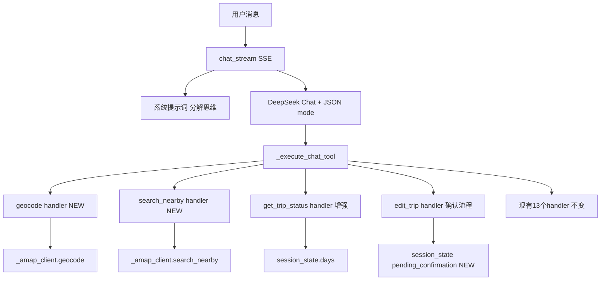
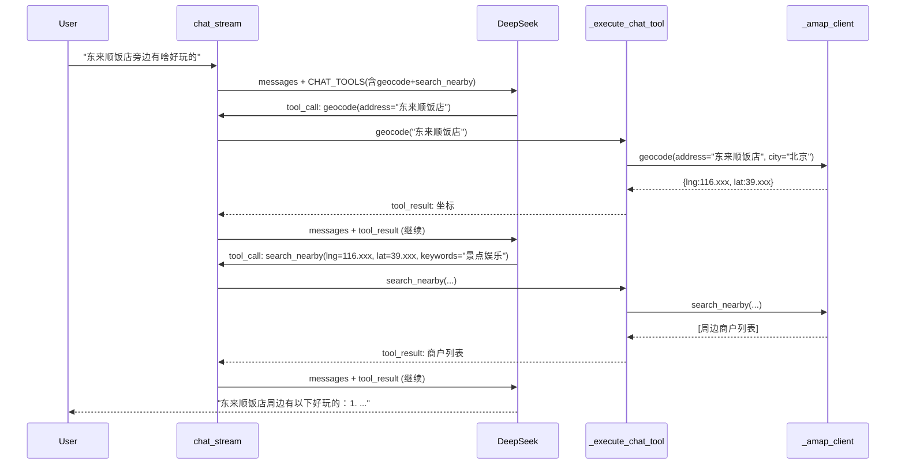
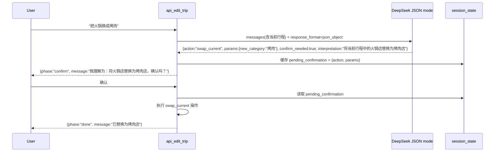
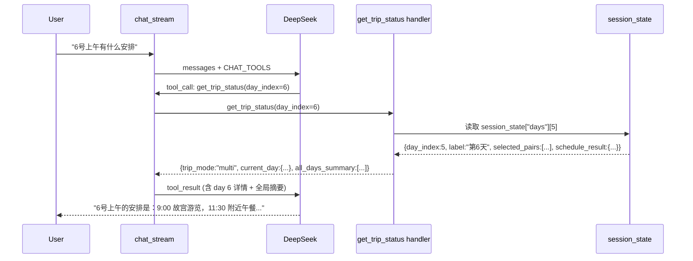

# Design Document

## Overview

**Purpose**: 将美团 AI 管家的 LLM 对话引擎从"关键词映射→单步工具调用"模式升级为"语义理解→分解式多步工具调用"模式。核心改动集中在 `server.py` 的 CHAT_TOOLS 工具链、系统提示词、工具 handler 和 LLM 输出解析层，不涉及 Skill 模块业务逻辑变更。

**Users**: 美团 AI 管家终端用户——通过对话界面查询周边商户、管理多日行程、编辑行程安排的消费者。

**Impact**: 修复 6 类 LLM 语义理解架构缺陷，使位置相关查询能正确解析用户提及的地名并搜索实际位置周边，复杂查询能自动分解为多步工具调用链，编辑操作增加确认步骤防止误操作。

### Goals

- CHAT_TOOLS 补齐 `geocode` + `search_nearby` 工具，使 LLM 能自主组合"地名→坐标→周边搜索"工具链
- 重写系统提示词，从关键词规则表升级为分解思维教学，引导 LLM 先分析问题结构再逐步调用工具
- `get_trip_status` 在多日模式下返回每日行程时间线，使 LLM 能回答"6号上午有什么安排"类问题
- 编辑类操作（edit_trip / multi_day_edit）增加两步确认：先返回意图解读，用户确认后再执行
- LLM 调用启用 JSON mode（`response_format`）替代脆弱正则，统一解析失败降级行为
- 坐标硬编码集中定义为单一常量，回退时输出警告日志

### Non-Goals

- 不更换 LLM 模型（仍使用 DeepSeek Chat）
- 不修改 Skill 模块内部算法（amap_poi、multi_day_scheduler 等业务逻辑保持不变）
- 不重构前端 UI（`index.html`）
- 不修改 OpenClaw meituan-bridge 插件（已注册的工具保持不变）
- 不在本次改动中消除全部 45 处硬编码坐标——仅集中定义常量并用于 LLM 相关调用路径

## Boundary Commitments

### This Spec Owns

- CHAT_TOOLS 工具定义列表（新增 2 个工具）
- `_execute_chat_tool()` 中的 geocode / search_nearby handler
- `chat_stream()` 系统提示词内容
- `get_trip_status` handler 的返回数据结构
- `api_edit_trip()` 和 `api_multi_day_edit()` 的确认流程
- `main.py` 中 `MeituanAgent._call_llm()` 的 `response_format` 参数支持
- `server.py` 中的坐标默认常量定义及 LLM 调用路径的回退日志

### Out of Boundary

- `skills/amap_poi/amap_poi.py` 中的 `geocode()` / `search_nearby()` 实现（已存在，直接调用）
- Flask 端点 `/api/poi/geocode` 和 `/api/poi/nearby`（已实现，不变）
- 前端 UI 适配新工具结果展示（延后至 P2）
- 非 LLM 调用路径的硬编码坐标消除（如距离计算、路线规划默认值）

### Allowed Dependencies

- `_amap_client`（AmapPOIClient 实例，server.py 中已初始化）—— 调用其 `geocode()` 和 `search_nearby()` 方法
- `main.py` 中的 `MeituanAgent._call_llm()` —— 增加 `response_format` 可选参数
- `session_state` —— 读写多日行程数据和确认状态
- `_execute_chat_tool()` 现有的 if/elif 分发模式 —— 新增分支遵循相同模式

### Revalidation Triggers

- CHAT_TOOLS 工具名称或参数 schema 变更 → meituan-bridge 插件需同步
- `_call_llm()` 签名变更 → 所有 LLM 调用点需验证兼容性
- `session_state` 新增键 → 多日行程相关 handler 需验证
- 系统提示词中引用的工具名变更 → 提示词需同步更新

## Architecture

### Existing Architecture Analysis

当前 `chat_stream()` 的 LLM 调用链：

```
用户消息 → chat_stream()
  ├── 构建 messages: system_prompt(关键词规则) + history + user_message
  ├── agent.chat_stream(messages, tools=CHAT_TOOLS)  ← 15个工具
  ├── 收到 tool_call → _execute_chat_tool(name, args)
  │   └── if/elif 分发到具体 handler → 返回 {status, ...}
  ├── tool 结果注入 messages 数组
  └── agent.chat_stream_continue() ← 最多3轮
```

关键约束与模式：
- CHAT_TOOLS 是模块级常量列表（line 4552），每个元素是 OpenAI function-calling 格式的 dict
- `_execute_chat_tool()` 是扁平 if/elif 链（line 4788），每个 handler 返回 `{"status": "SUCCESS"|"ERROR"|"CONFIRM_REQUIRED", ...}` dict
- 所有 LLM 调用通过 `agent._call_llm()` 或 `agent.chat_stream()` 统一入口
- DeepSeek API 目前未使用 `response_format` 参数
- handler 可直接访问 `_amap_client`（全局变量）

### Architecture Pattern & Boundary Map

改动遵循现有分层，不引入新架构模式：



**Architecture Integration**:
- Selected pattern: 在现有工具分发模式内扩展——新增 handler 遵循相同的 if/elif 结构
- Domain boundaries: 工具定义 + handler + 提示词全部在 `server.py` 内，不跨越 Skill 模块边界
- Existing patterns preserved: CHAT_TOOLS 列表结构、handler 返回格式、SSE 事件流、session_state 字典模式
- New components rationale: geocode/search_nearby handler 是将已有 Flask 端点逻辑内联到工具分发层，避免 LLM→Flask HTTP 调用的额外跃点
- Steering compliance: 遵循 `tech.md` 中"LLM 调用通过 MeituanAgent 统一入口"和 `structure.md` 中"入口薄层——server.py 只做路由分发"原则

### Technology Stack

| Layer | Choice / Version | Role in Feature | Notes |
|-------|------------------|-----------------|-------|
| Backend LLM | DeepSeek Chat (deepseek-chat) | 对话推理 + 工具调用 | 不变；新增 `response_format` 参数 |
| Backend API | Flask + Flask-CORS | SSE 流式 + REST 端点 | 不变 |
| Backend Skills | amap_poi (已有) | geocode / nearby search 实际调用 | 不变；CHAT_TOOLS handler 直接调用 |
| LLM SDK | openai Python SDK | DeepSeek API 调用 | 不变；通过 `_call_llm()` 封装 |
| Runtime | gunicorn | 生产服务器 | 不变 |

## File Structure Plan

### Modified Files

- **`server.py`** — 主改动文件（6 项修改）：
  - 新增 `DEFAULT_CENTER_COORD` 模块级常量
  - CHAT_TOOLS 列表新增 `geocode` 和 `search_nearby` 工具定义（+2 条目）
  - `_execute_chat_tool()` 新增 `geocode` 和 `search_nearby` handler 分支（+2 elif）
  - `get_trip_status` handler 增强：多日模式下返回 `days[]` 时间线摘要
  - `chat_stream()` 系统提示词重写：从关键词规则表升级为分解思维教学
  - `_search_poi()` 签名增加可选 `center_coord` 参数；坐标回退处增加 `print()` 警告日志
  - `api_edit_trip()` / `api_multi_day_edit()` 确认流程：LLM 调用启用 JSON mode；新增确认状态管理

- **`main.py`** — 轻量改动：
  - `MeituanAgent._call_llm()` 增加 `response_format` 可选参数，透传至 `client.chat.completions.create()`
  - `MeituanAgent.chat_stream()` 和 `chat_stream_continue()` 方法同样支持透传 `response_format`

### Responsibility Summary

| File | Responsibility |
|------|---------------|
| `server.py` | 工具定义、handler 实现、系统提示词、确认流程、坐标常量、警告日志 |
| `main.py` | LLM API 调用层：为 `_call_llm` 提供 `response_format` 支持 |

## System Flows

### Flow 1: 位置感知搜索（geocode → search_nearby 工具链）



**关键决策**: geocode handler 直接调用 `_amap_client.geocode()`，不通过 Flask HTTP 端点再绕一层。这样避免了额外网络跃点和序列化开销。两个 handler 返回统一的 `{"status": "SUCCESS", "data": ...}` 格式。

### Flow 2: 编辑确认流程（两步确认）



**关键决策**: 确认状态使用 `session_state["_pending_confirmation"]` 存储，不持久化到文件。确认超时不处理（简化方案，会话级确认足够）。`confirm_needed` 由 LLM 根据操作影响范围判断——简单查询不需要确认，修改型操作默认需要。

### Flow 3: 多日行程查询



## Requirements Traceability

| Requirement | Summary | Components | Interfaces | Flows |
|-------------|---------|------------|------------|-------|
| 1.1 | 地名→坐标→周边搜索自动链 | CHAT_TOOLS(geocode+search_nearby), _execute_chat_tool handler | geocode(address)→{lng,lat}, search_nearby(lng,lat,keywords)→[POI] | Flow 1 |
| 1.2 | "XX附近"表达式的坐标解析 | CHAT_TOOLS(geocode) | geocode(address) | Flow 1 |
| 1.3 | 有效坐标用于搜索中心点 | _execute_chat_tool(search_nearby handler) | search_nearby 参数传递 | Flow 1 |
| 1.4 | 地理编码失败时用户提示 | _execute_chat_tool(geocode handler) | 错误返回 {status:"ERROR", message} | Flow 1 |
| 1.5 | 对话工具集含地理编码+周边搜索 | CHAT_TOOLS 列表 | 工具 schema 定义 | — |
| 2.1 | 复杂查询分解为子任务 | chat_stream 系统提示词 | — | Flow 1 |
| 2.2 | geocode→search_nearby 顺序执行 | 系统提示词 + LLM 推理 | geocode → search_nearby 依赖 | Flow 1 |
| 2.3 | 先查行程再给建议 | get_trip_status handler | get_trip_status → 后续工具 | Flow 3 |
| 2.4 | 系统提示词教学分解思维 | chat_stream 系统提示词 | — | — |
| 2.5 | 歧义时主动澄清 | 系统提示词规则 | — | — |
| 3.1 | 查询特定日期行程安排 | get_trip_status handler(增强) | 返回 daily_timeline | Flow 3 |
| 3.2 | 多日行程整体概况 | get_trip_status handler(增强) | 返回 all_days_summary | Flow 3 |
| 3.3 | 多日模式同时提供当日+多日数据 | get_trip_status handler(增强) | trip_mode 判断 | Flow 3 |
| 3.4 | 超出范围日期提示 | get_trip_status handler(增强) | day_index 边界检查 | — |
| 4.1 | 编辑前先返回意图解读 | api_edit_trip / api_multi_day_edit | confirm_needed 字段 | Flow 2 |
| 4.2 | 解读结果用自然语言描述 | LLM 输出 (JSON mode) | interpretation 字段 | Flow 2 |
| 4.3 | 确认后执行修改 | session_state._pending_confirmation | 确认回调 | Flow 2 |
| 4.4 | 否定/修正时不执行原操作 | session_state._pending_confirmation | 重新解读 | Flow 2 |
| 4.5 | 区分信息查询和修改操作 | LLM 意图判断 | confirm_needed 字段 | — |
| 5.1 | 使用 JSON mode 替代正则 | _call_llm(response_format) | response_format={"type":"json_object"} | — |
| 5.2 | 解析失败有明确降级 | 各调用点的 try/except 加固 | 降级行为一致性 | — |
| 5.3 | 解析失败输出警告日志 | print() 日志 | — | — |
| 5.4 | 降级时提供清晰用户提示 | 降级 handler | — | — |
| 6.1 | 坐标回退输出警告+上下文 | _search_poi / handler | print() 日志 | — |
| 6.2 | 默认坐标定义为单一常量 | DEFAULT_CENTER_COORD | — | — |
| 6.3 | 搜索允许显式传入中心坐标 | _search_poi(center_coord) | center_coord 参数 | — |
| 6.4 | 优先从上下文推断位置 | _search_poi / handler | session_state 坐标推断 | — |

## Components and Interfaces

| Component | Domain/Layer | Intent | Req Coverage | Key Dependencies | Contracts |
|-----------|--------------|--------|--------------|------------------|-----------|
| CHAT_TOOLS 扩展 | 工具定义 | 新增 geocode + search_nearby 工具 schema | 1.1-1.5 | _amap_client (P0) | API |
| _execute_chat_tool handler | 工具分发 | 处理 geocode / search_nearby 调用 | 1.1-1.4, 3.1-3.4 | _amap_client, session_state (P0) | Service |
| chat_stream 系统提示词 | LLM 提示层 | 引导分解式思维 + 工具链使用 | 2.1-2.5 | CHAT_TOOLS (P0) | — |
| get_trip_status 增强 | 工具 handler | 返回多日行程时间线 | 3.1-3.4 | session_state.days (P0) | Service |
| 编辑确认流程 | API handler | 两步确认：解读→确认→执行 | 4.1-4.5 | _call_llm(response_format), session_state (P0) | Service |
| _call_llm JSON mode | LLM API 层 | 启用结构化输出 | 5.1-5.4 | DeepSeek API (P0) | API |
| DEFAULT_CENTER_COORD | 配置常量 | 坐标默认值集中管理 | 6.1-6.4 | — | — |

### 工具定义层

#### CHAT_TOOLS: geocode

| Field | Detail |
|-------|--------|
| Intent | 将地名/地址解析为经纬度坐标 |
| Requirements | 1.1, 1.2, 1.4, 1.5 |

**API Contract**:
| Method | Tool Name | Parameters | Returns | Errors |
|--------|-----------|------------|---------|--------|
| function_call | geocode | address (string, required), city (string, default "北京") | {status, data: {lng, lat, address, city}} | {status:"ERROR", message} |

```python
{
    "type": "function",
    "function": {
        "name": "geocode",
        "description": "将地名或地址解析为经纬度坐标。用于在搜索周边商户前先确定位置。例如：'东来顺饭店'→{lng:116.xxx, lat:39.xxx}",
        "parameters": {
            "type": "object",
            "properties": {
                "address": {"type": "string", "description": "地名或详细地址，如'东来顺饭店'、'故宫'、'三里屯太古里'"},
                "city": {"type": "string", "description": "所在城市，默认北京"}
            },
            "required": ["address"]
        }
    }
}
```

#### CHAT_TOOLS: search_nearby

| Field | Detail |
|-------|--------|
| Intent | 在指定坐标周边搜索商户 |
| Requirements | 1.1, 1.3, 1.5 |

**API Contract**:
| Method | Tool Name | Parameters | Returns | Errors |
|--------|-----------|------------|---------|--------|
| function_call | search_nearby | lng (number, required), lat (number, required), keywords (string), radius (number, default 3000) | {status, data: [POI列表]} | {status:"ERROR", message} |

```python
{
    "type": "function",
    "function": {
        "name": "search_nearby",
        "description": "在指定坐标周边搜索商户（餐厅、景点、咖啡店等）。使用前应先通过 geocode 获取目标位置的坐标。",
        "parameters": {
            "type": "object",
            "properties": {
                "lng": {"type": "number", "description": "中心点经度"},
                "lat": {"type": "number", "description": "中心点纬度"},
                "keywords": {"type": "string", "description": "搜索关键词，如'火锅'、'咖啡'、'景点'、'好玩'"},
                "radius": {"type": "number", "description": "搜索半径（米），默认3000"}
            },
            "required": ["lng", "lat"]
        }
    }
}
```

### Handler 层

#### geocode handler (in `_execute_chat_tool`)

| Field | Detail |
|-------|--------|
| Intent | 接收 LLM 的 geocode 工具调用，调用 _amap_client.geocode() 并返回格式化结果 |
| Requirements | 1.1, 1.2, 1.4 |

**Responsibilities & Constraints**
- 从 arguments 提取 address（必填）和 city（可选，默认 "北京"）
- 调用 `_amap_client.geocode(address, city)` 获取坐标
- 返回 `{status: "SUCCESS", data: {lng, lat, address, city}}` 或 `{status: "ERROR", message: "..."}`
- 不缓存结果（LLM 可在同轮对话中复用坐标）

**Dependencies**
- Outbound: `_amap_client.geocode()` — 高德地理编码（P0）

**Implementation Notes**
- Integration: 在 `_execute_chat_tool()` 的 if/elif 链中新增 `elif tool_name == "geocode":` 分支
- Validation: address 为空时返回 error
- Risks: 高德 API 可能返回 None（未找到地址），需处理此情况

#### search_nearby handler (in `_execute_chat_tool`)

| Field | Detail |
|-------|--------|
| Intent | 接收 LLM 的 search_nearby 工具调用，调用 _amap_client.search_nearby() 并返回商户列表 |
| Requirements | 1.1, 1.3 |

**Responsibilities & Constraints**
- 从 arguments 提取 lng, lat（必填）、keywords（可选）、radius（可选，默认 3000）
- 调用 `_amap_client.search_nearby(lng, lat, radius, keywords)`
- 返回 `{status: "SUCCESS", data: [POI列表]}` 或 `{status: "ERROR", message: "..."}`

**Dependencies**
- Outbound: `_amap_client.search_nearby()` — 高德周边搜索（P0）

**Implementation Notes**
- Integration: 在 `_execute_chat_tool()` 中新增 `elif tool_name == "search_nearby":` 分支
- Validation: lng/lat 非数字时返回 error

### 编辑确认流程

#### api_edit_trip 确认机制

| Field | Detail |
|-------|--------|
| Intent | LLM 先输出意图解读（含 confirm_needed），修改型操作等待用户确认后执行 |
| Requirements | 4.1-4.5 |

**Responsibilities & Constraints**
- LLM 调用启用 `response_format={"type": "json_object"}`
- LLM 输出必须包含 `action`, `params`, `confirm_needed` (bool), `interpretation` (string)
- 当 `confirm_needed=true` 时：缓存意图到 `session_state["_pending_confirmation"]`，返回 `{phase: "confirm", interpretation, ...}` 给前端
- 当 `confirm_needed=false` 时（纯查询）：直接执行
- 确认回调：读取 `_pending_confirmation`，执行原始 action，清除缓存
- 修正回调：读取 `_pending_confirmation`，将用户修正信息追加到 LLM prompt 重新理解，清除旧缓存

**Dependencies**
- Outbound: `agent._call_llm()` — LLM 调用（P0）
- Inbound: 前端确认/修正请求 — 需前端配合发送确认指令（P1，可复用现有 edit_trip 端点）

**Implementation Notes**
- Integration: 在 `api_edit_trip()` 函数体内增加确认状态判断分支
- Validation: 确认状态超时不处理（会话级，重启即清除）
- Risks: 前端需要能展示确认卡片并发送确认/修正指令——当前 index.html 已有 chat 界面基础，后续 P2 完善

## Data Models

### session_state 变更

**新增键**:

| Key | Type | Purpose |
|-----|------|---------|
| `_pending_confirmation` | dict or None | 缓存待确认的编辑意图：`{action, params, interpretation, created_at}` |

**读取键增强**:

`get_trip_status` handler 新增读取路径：
- `session_state["trip_mode"]` — 判断单日/多日
- `session_state["days"][day_index]` — 指定日的 `selected_pairs` + `schedule_result`
- `session_state["days"]` — 全部日期的摘要

### get_trip_status 返回结构变更

**单日模式**（不变）:
```python
{"status": "SUCCESS", "data": {
    "active": True/False,
    "trip_mode": "single",
    "destinations": [{"category": str, "name": str, "shop_id": str}],
    "transport": str, "time": str, "phase": str
}}
```

**多日模式**（增强）:
```python
{"status": "SUCCESS", "data": {
    "active": True,
    "trip_mode": "multi",
    "total_days": int,
    "current_day": {                          # 当前活跃日
        "day_index": int, "label": str,
        "timeline": [{"time": str, "activity": str, "location": str, "shop_id": str}],
        "free_slots": [{"start": str, "end": str}]
    },
    "all_days_summary": [                     # 全局摘要
        {"day_index": int, "label": str, "activity_count": int, "key_activities": [str]}
    ]
}}
```

### DEFAULT_CENTER_COORD 常量

```python
# 模块级常量，替代分散的硬编码 "39.93,116.45"
DEFAULT_CENTER_COORD = "39.93,116.45"
```

LLM 相关调用路径引用此常量（`_search_poi`、`_execute_chat_tool` 中的默认值、`chat_stream` 上下文构建）。非 LLM 路径的硬编码暂不统一（P2 后续）。

## Error Handling

### Error Categories and Responses

**工具调用错误**（geocode / search_nearby handler）:
- 地理编码无结果 → `{status: "ERROR", message: "未找到地址'XXX'，请检查地名是否正确"}`
- 周边搜索无结果 → `{status: "SUCCESS", data: [], message: "该位置周边暂未找到匹配商户"}`
- 参数缺失 → `{status: "ERROR", message: "缺少必填参数: address/lng/lat"}`

**JSON 解析降级**（使用 JSON mode 后大幅减少，但仍需防御）:
- `json.JSONDecodeError` → print 警告日志 + 返回 clarify / 安全默认值
- `response_format` API 错误 → 降级为 prompt 内 instruct（regex fallback）

**坐标回退告警**:
- 回退触发时 → `print(f"[coord] 回退到默认坐标 {DEFAULT_CENTER_COORD}，调用来源: {context}", flush=True)`
- 回退上下文包含：调用函数名、用户原始输入摘要（截断至 50 字符）

**编辑确认异常**:
- `_pending_confirmation` 过期（会话重启后丢失）→ 提示用户重新发起编辑
- 确认超时 → 不处理（会话级，用户可重新编辑）

### Monitoring

- 坐标回退事件：通过 `print()` 输出到 gunicorn 日志，带 `[coord]` 标签便于 grep 监控
- JSON 解析失败：通过 `print()` 输出警告，带 `[json_parse]` 标签和原始响应前 100 字符
- 地理编码失败率：通过 `[geocode]` 标签输出，含地名和失败原因

## Testing Strategy

### Unit Tests
1. `_execute_chat_tool("geocode", {"address": "故宫"})` → 返回有效 `{lng, lat}` 或 ERROR
2. `_execute_chat_tool("search_nearby", {"lng": 116.455, "lat": 39.932, "keywords": "火锅"})` → 返回商户列表
3. `_execute_chat_tool("get_trip_status", {})` 在多日模式下 → 返回含 `all_days_summary` 的数据
4. geocode handler 空 address → 返回 ERROR status
5. search_nearby handler 缺少 lng/lat → 返回 ERROR status

### Integration Tests
1. chat_stream 处理"故宫附近有咖啡馆吗"→ LLM 调用 geocode("故宫") → search_nearby(故宫坐标, "咖啡") → 返回商户列表
2. chat_stream 处理"6号上午有什么安排"（多日模式）→ LLM 调用 get_trip_status → 返回 day 6 时间线
3. api_edit_trip 发送修改指令 → 返回 confirm 阶段（confirm_needed=true）+ interpretation → 发送确认 → 执行修改
4. _search_poi 传入 center_coord → 使用传入坐标而非默认值
5. 坐标无效时 _search_poi 回退 → gunicorn 日志含 `[coord]` 警告

### E2E Tests
1. 完整位置搜索对话："东来顺饭店旁边有啥好玩的" → 返回东来顺饭店周边的真实商户
2. 多日行程查询："第三天还有空吗" → 返回 day 3 空闲时段
3. 编辑确认完整流程：发送编辑 → 看到确认 → 点击确认 → 行程更新

### Regression Checks
- 现有 13 个 CHAT_TOOLS handler 行为不变（单日行程搜索、提醒、天气、偏好读写等）
- 单日模式下 get_trip_status 返回结构与改动前兼容
- 关键词快速路径 `_try_fast_category_match()` 行为不变
