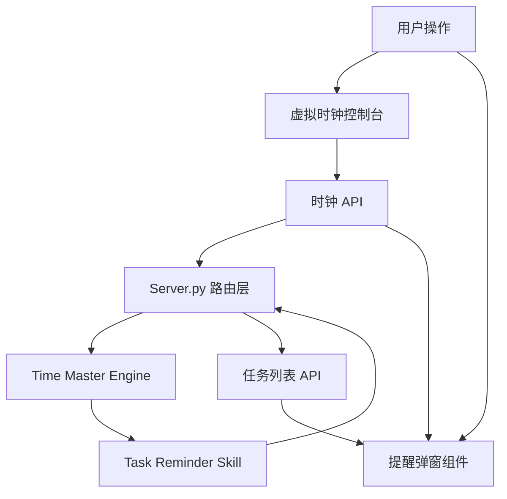
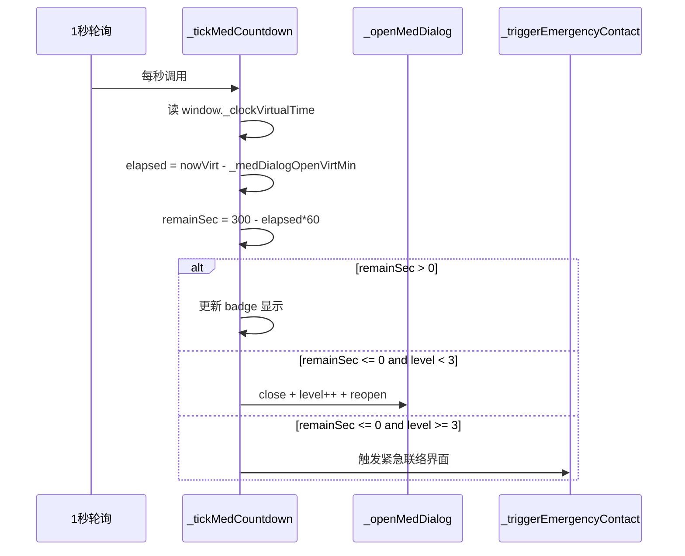

# Design Document

## Overview
**Purpose**: 修复 `4d82a41` 版本的 5 个联动缺陷，恢复提醒弹窗的可用性。弹窗跟随虚拟时钟显示 5 虚拟分钟倒计时后自动升级催促等级，弹窗仅覆盖手机屏幕区域，延后操作不产生可见图标，虚拟时钟操作后状态正确同步，速度定义前后端一致。

**Users**: 沙盒演示操作者（通过虚拟时钟控制台操作时间、观察弹窗行为）。
**Impact**: 修改弹窗 DOM 定位、时钟 API 响应字段、任务列表过滤逻辑、时钟速度语义。不影响排程引擎和提醒管线核心业务规则。

### Goals
- 弹窗在虚拟时间到达提醒时刻后显示 5:00 倒计时，倒计时跟随虚拟时钟速度实时递减
- 倒计时归零自动升级催促等级（1→2→3→紧急联络），每级停留 5 虚拟分钟
- 弹窗和半透明遮罩仅覆盖手机屏幕区域，左右控制台在弹窗期间可操作
- 延后 30 分钟提醒不在任务列表中创建可见图标
- 虚拟时钟 jump/offset/speed 操作后在响应中返回 is_running 状态
- 时钟速度语义修正：1x = 60 真实秒 / 虚拟分钟（模拟真实时间），60x = 1 真实秒 / 虚拟分钟

### Non-Goals
- 不重构 SSE 双通道事件投递架构
- 不改动 task_reminder_skill 的业务规则（催促判定逻辑）
- 不修改 time_master 的自动走时核心循环
- 不新增持久化存储

## Boundary Commitments

### This Spec Owns
- 弹窗倒计时 UI 逻辑（显示、递减、归零升级）
- 弹窗 DOM 挂载目标（`#main-phone-container`）
- 虚拟时钟 API 响应中的 `is_running` 字段
- 延后节点的 `_postponed` 标记与过滤
- 前端时钟速度枚举值（1x/60x/300x）及其语义

### Out of Boundary
- 提醒管线（task_reminder_skill）的催促判定与状态机逻辑
- time_master 的 auto_tick 核心循环与 Timer 管理
- SSE 推送通道的双重投递架构
- 管家记忆 Markdown 的持久化格式

### Allowed Dependencies
- `time_master.py` — 可修改 `_build_output` 添加 `is_running` 字段；可修改 `set_speed` 验证范围
- `task_reminder_skill.py` — 可在 `handle_user_action` 延后分支添加 `_postponed` 标记
- `server.py` — 可修改 `/api/reminder/tasks` 过滤 `_postponed` 节点；可修改 `/api/clock/jump`、`/api/clock/offset` 透传 `is_running`
- `index.html` — 可修改弹窗 DOM 结构、挂载逻辑、倒计时轮询、clockUpdateUI、速度枚举

### Revalidation Triggers
- `_build_output` 响应结构变更 → 所有消费 clock API 响应的前端代码需复查
- 时钟速度语义变更 → 依赖当前速度行为的测试/演示需重新校准
- `_postponed` 标记进入 schedule_nodes → 任何读取 schedule_nodes 的代码需确认兼容

## Architecture

### Existing Architecture Analysis
当前系统为 **Python Flask 后端 + HTML5 单页前端**，关键数据流：

```
[time_master.py]  ──(triggered events)──▶ [server.py _process_clock_triggers]
                                                    │
                                    ┌───────────────┴───────────────┐
                                    ▼                               ▼
                          [SSE /api/sse/events]          [GET /api/clock/events]
                                    │                               │
                                    └───────────┬───────────────────┘
                                                ▼
                                    [index.html handleReminderEvent]
                                                │
                                                ▼
                                    [renderReminderDialog → _openMedDialog]
```

弹窗倒计时当前依赖 1 秒轮询 `setInterval` 调用 `_tickMedCountdown()`，读取 `window._clockVirtualTime` 计算虚拟时间差。弹窗挂载到 `document.body`，使用 `position:fixed`。

### Architecture Pattern & Boundary Map



**Architecture Integration**:
- Selected pattern: 保持现有分层架构（路由层 → Skill 引擎层），仅在数据契约层面做增量修改
- Domain boundaries: 弹窗 UI 逻辑独立于后端提醒管线；时钟状态同步通过 API 响应字段桥接
- Existing patterns preserved: SSE + 轮询双通道、patcher 链拦截 `clockFetch`、1 秒轮询驱动 UI 更新
- New components rationale: 不需要新组件，仅在现有文件内修改

### Technology Stack

| Layer | Choice / Version | Role in Feature | Notes |
|-------|------------------|-----------------|-------|
| Frontend | HTML5 + vanilla JS | 弹窗 UI、倒计时、DOM 定位 | 修改 index.html |
| Backend | Python 3.9+ Flask | API 响应字段扩展、过滤逻辑 | 修改 server.py |
| Engine | Python (time_master) | 时钟状态透传 | 修改 time_master.py |
| Skill | Python (task_reminder_skill) | 延后标记 | 修改 task_reminder_skill.py |

## File Structure Plan

### Modified Files
- `index.html` — 弹窗倒计时逻辑（`_tickMedCountdown` 公式修正、`_openMedDialog` 初始化）、弹窗挂载位置（`initReminderDialog` 挂到 `#main-phone-container`）、时钟 UI 同步（`clockUpdateUI` 已含 `window._clockVirtualTime` 同步，本次确认保留）、速度枚举值修正（1x/60x/300x 映射）、`clockSliderChange`/`clockFastForward`/`clockSetSpeed` 传递 `is_running`
- `skills/time_master/time_master.py` — `_build_output` 添加 `is_running` 字段；`set_speed`/`start_auto_tick` 速度语义修正（speed = 虚拟分钟/真实秒，1x = 1/60）
- `skills/task_reminder_skill/task_reminder_skill.py` — `handle_user_action` 延后 30 分钟分支，为新增 schedule node 添加 `_postponed: True` 标记
- `server.py` — `/api/reminder/tasks` 过滤 `_postponed` 节点；`/api/clock/jump` 和 `/api/clock/offset` 透传 `is_running`

## System Flows

### 弹窗倒计时自动升级流程



**Key Decisions**: 倒计时复用现有 1 秒 `setInterval` 轮询，不在弹窗内部创建独立计时器。`remainSec` 公式 `300 - elapsed * 60` 将虚拟分钟差转为虚拟秒，正确实现 5 虚拟分钟（300 虚拟秒）倒计时。`_tickMedCountdown` 仅在弹窗可见时执行。

### 速度修正对照表

| UI 标签 | 前端 speed 值 | 后端 speed (虚拟分钟/真实秒) | 5 虚拟分钟 = |
|--------|-------------|---------------------------|-------------|
| 1x | 1/60 | 1/60 | 300 真实秒 (5 分钟) |
| 60x | 1 | 1 | 5 真实秒 |
| 300x | 5 | 5 | 1 真实秒 |

## Requirements Traceability

| Requirement | Summary | Components | Interfaces | Flows |
|-------------|---------|------------|------------|-------|
| 1.1 | 弹窗显示倒计时徽章 | `_openMedDialog`, `initReminderDialog` | `reminder-countdown-badge` DOM | 弹窗倒计时自动升级 |
| 1.2 | 倒计时跟随虚拟时钟递减 | `_tickMedCountdown` | `window._clockVirtualTime` | 弹窗倒计时自动升级 |
| 1.3 | 倒计时归零升级催促 | `_tickMedCountdown`, `_openMedDialog` | `_medEscalationLevel` | 弹窗倒计时自动升级 |
| 1.4 | 紧急联络人触发 | `_triggerEmergencyContact` | `reminder-dialog-card` DOM | 弹窗倒计时自动升级 |
| 1.5 | 用户操作停止倒计时 | `_stopRinging`, 按钮 onclick | 按钮事件 | — |
| 1.6 | 剩余 ≤60s 红色警示 | `_tickMedCountdown` badge 样式 | badge CSS | — |
| 2.1-2.6 | 时钟 is_running 状态 | `_build_output`, `clockUpdateUI` | `/api/clock/*` 响应 | 速度修正对照表 |
| 3.1-3.4 | 弹窗定位手机区域 | `initReminderDialog` | `#main-phone-container` | — |
| 4.1-4.4 | 延后图标过滤 | `handle_user_action`, `/api/reminder/tasks` | `_postponed` 标记 | — |
| 5.1-5.4 | 速度定义一致 | `set_speed`, `start_auto_tick`, 前端按钮 | speed 参数 | 速度修正对照表 |

## Components and Interfaces

### 前端: 弹窗倒计时模块

| Component | Domain/Layer | Intent | Req Coverage | Key Dependencies | Contracts |
|-----------|--------------|--------|--------------|------------------|-----------|
| `_tickMedCountdown` | UI/Logic | 每秒检查倒计时并更新 badge | 1.2, 1.3, 1.6 | `window._clockVirtualTime` (P0) | State |
| `_openMedDialog` | UI/Presentation | 打开弹窗并初始化倒计时 | 1.1, 1.3 | `_tickMedCountdown` (P0) | State |
| `_triggerEmergencyContact` | UI/Presentation | 紧急联络人界面 | 1.4 | `_openMedDialog` (P0) | State |
| `initReminderDialog` | UI/Setup | 创建弹窗 DOM 并挂载 | 3.1, 3.2 | `#main-phone-container` (P0) | DOM |
| `clockUpdateUI` | UI/Sync | 同步虚拟时间到全局状态 | 2.4, 2.5 | `/api/clock/status` (P0) | State |
| 速度按钮组 | UI/Control | 倍速切换 | 5.1-5.4 | `clockSetSpeed` (P0) | API |

#### _tickMedCountdown

| Field | Detail |
|-------|--------|
| Intent | 每秒被轮询调用，计算弹窗已打开虚拟分钟数，更新倒计时 badge，归零时触发升级 |
| Requirements | 1.2, 1.3, 1.6 |

**Responsibilities & Constraints**
- 仅在 `dlg.style.display === 'flex'` 且 `_medDialogOpenVirtMin > 0` 时执行
- 计算 `elapsed = _getCurrentVirtMinutes() - _medDialogOpenVirtMin`（跨 0 点补偿 +1440）
- `remainSec = Math.max(0, 300 - elapsed * 60)` 得出剩余虚拟秒
- `remainSec <= 60` 时 badge 变红；`remainSec <= 0` 时触发升级

**Dependencies**
- Inbound: 1 秒 `setInterval` 轮询 (P2)
- Outbound: `_getCurrentVirtMinutes()` — 读取 `window._clockVirtualTime` (P0)
- Outbound: `_stopRinging`, `closeReminderDialog`, `_openMedDialog` — 升级时调用 (P0)

**Contracts**: State

##### State Management
- State model: `_medDialogOpenVirtMin` (弹窗打开时的虚拟分钟数), `_medEscalationLevel` (当前催促等级 1-3), `_medPendingInfo` (弹窗数据)
- Persistence & consistency: 纯内存，`_stopRinging` 时重置 `_medDialogOpenVirtMin = 0`
- Concurrency strategy: 单线程 JS，无并发问题

**Implementation Notes**
- Integration: 在现有 1 秒 `setInterval` 末尾追加 `_tickMedCountdown()` 调用
- Validation: 通过 `testReminderPopup()` 手动触发测试
- Risks: 急速倍速（300x）下 5 虚拟分钟 = 1 真实秒，倒计时 badge 更新频率不足以展示每个虚拟秒 → 可接受，badge 在轮询间隔内跳跃显示

### 后端: 时钟状态透传

| Component | Domain/Layer | Intent | Req Coverage | Key Dependencies | Contracts |
|-----------|--------------|--------|--------------|------------------|-----------|
| `_build_output` | Engine/Data | 构建统一响应 dict | 2.1-2.3 | `ClockState.is_running` (P0) | API |
| `set_speed` | Engine/Control | 设置时钟速度 | 5.1-5.4 | `_build_output` (P0) | API |
| `/api/reminder/tasks` | API/Route | 返回可见任务列表 | 4.2, 4.4 | `schedule_nodes` (P0) | API |

#### _build_output

| Field | Detail |
|-------|--------|
| Intent | 从 ClockState 构建统一 JSON 响应，新增 `is_running` 字段 |
| Requirements | 2.1, 2.2, 2.3 |

##### API Contract
响应增加字段:
```json
{
  "virtual_time": "12:00",
  "virtual_minutes": 720,
  "is_running": true,    // NEW
  ...
}
```

#### `/api/reminder/tasks` 过滤逻辑

| Field | Detail |
|-------|--------|
| Intent | 返回可见提醒任务列表，排除 `_postponed` 标记的节点 |
| Requirements | 4.2, 4.4 |

##### API Contract
过滤伪代码:
```python
tasks = [n for n in cs.schedule_nodes 
         if n.get("type") in ("WATER", "MED", "CUSTOM") 
         and not n.get("_postponed")]
```

#### `handle_user_action` 延后分支

| Field | Detail |
|-------|--------|
| Intent | 延后 30 分钟时为新 schedule node 添加 `_postponed: True` |
| Requirements | 4.1 |

**Implementation Notes**
- 在 `current_schedule.append({...})` 处添加 `"_postponed": True`
- 不影响原有的 `IDLE` 状态重置和 30 分钟后二次唤醒逻辑

## Data Models

### Domain Model
- `ClockState`: 新增 `is_running: bool` 字段透出到响应
- `schedule_nodes[]`: 节点 dict 新增可选 `_postponed: bool` 字段

### API Data Transfer
- `GET/POST /api/clock/jump` 响应: 新增 `is_running: bool`
- `GET/POST /api/clock/offset` 响应: 新增 `is_running: bool`
- `POST /api/clock/speed` 响应: 新增 `is_running: bool`
- `GET /api/reminder/tasks` 响应: 过滤 `_postponed` 节点

## Error Handling

### Error Strategy
- 弹窗 DOM 挂载目标不存在时 fallback 到 `document.body`
- `_getCurrentVirtMinutes` 在 `window._clockVirtualTime` 未定义时退回到真实系统时间
- 倒计时跨 0 点时 `elapsed` 补偿 1440 分钟

## Testing Strategy

### Unit Tests (手动验证)
1. 弹窗打开 → 检查 `reminder-countdown-badge` 显示 `⏱️ 5:00`
2. 1x 速度下等 60 秒 → badge 显示 `⏱️ 4:00`
3. 60x 速度下等 5 秒 → 弹窗应升级到第 2 级
4. 300x 速度下等 3 秒 → 弹窗应触发紧急联络界面

### Integration Tests (手动验证)
5. 设置 13:00 吃药提醒 → 拖动时间滑块到 13:00 → 弹窗在手机屏幕内弹出
6. 弹窗显示期间 → 左侧控制台快进按钮可点击
7. 点击「延后 30 分钟」→ 弹窗关闭 → 任务列表不变
8. 快进 30 分钟 → check 弹窗再次弹出（延后生效）

### E2E Tests (手动验证)
9. 开启虚拟时钟 → 设置提醒 → 等待触发 → 观察倒计时递减 → 自动升级 → 紧急联络人
10. 拖动时间滑块跳转 → check 播放按钮保持正确状态
11. 切换倍速 1x → 60x → 300x → check 按钮高亮正确
