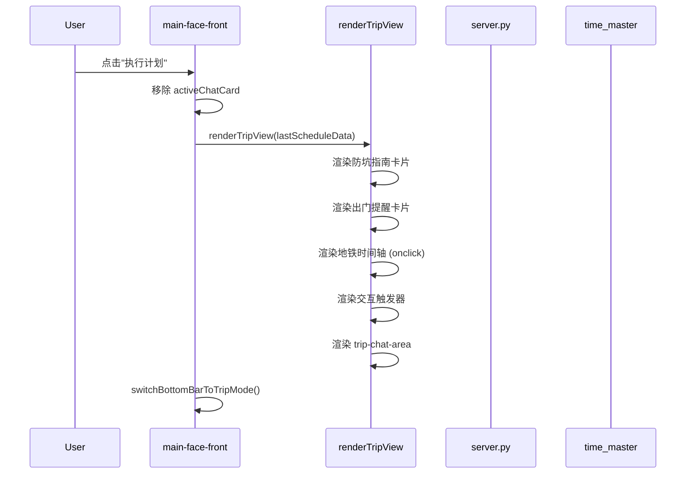
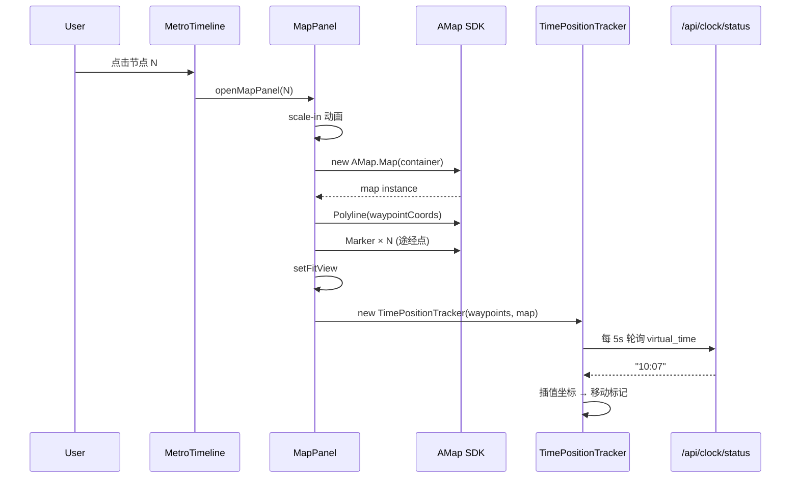
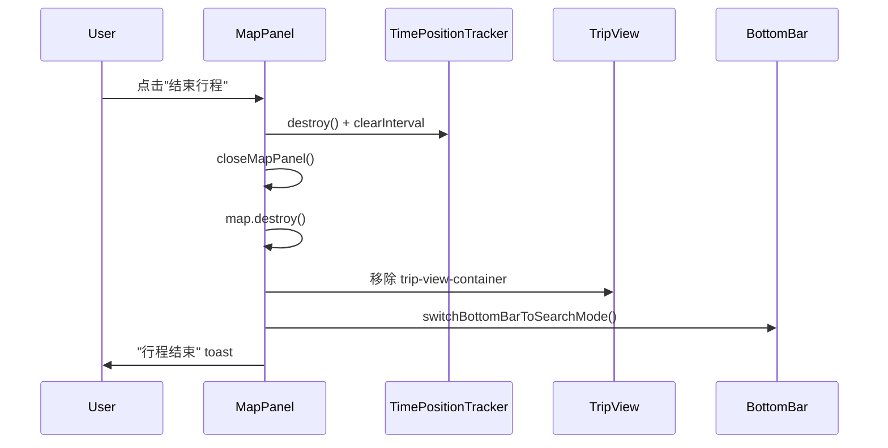

# Design Document

## Overview

**Purpose**: 取消 exec-cover 跳转层，将行程内容（防坑指南、出门提醒、地铁式时间轴）融入 `#main-face-front` 主界面，新增高德 JS API 2.0 地图面板，通过虚拟时钟驱动用户位置的时间动画。

**Users**: 美团 AI 助手使用者，在确认行程计划后查看行程详情和地图路线。

**Impact**: 移除 `#exec-cover` 遮罩层及相关 JS 函数（~200 行），新增地图面板 HTML + TimePositionTracker + 行程视图渲染函数（~300 行），重构底部输入栏和结束行程逻辑。

### Goals
- 取消 exec-cover 跳转，行程内容在主界面 `#dynamic-content` 中渲染
- 防坑指南、出门提醒、地铁时间轴、交互触发器全部内联到主界面
- 高德地图面板通过点击时间轴节点打开，显示路线折线+途经点标记
- 虚拟时钟驱动的用户位置标记在地图上随时间移动
- 底部输入栏双模式：搜索模式 ↔ 行程聊天模式

### Non-Goals
- 不修改贪心路径规划算法（`route_planner`）
- 不修改虚拟时钟核心逻辑（`time_master`）
- 不新增后端 API 端点
- 不引入构建工具或 npm 包（保持 CDN 单文件架构）

## Boundary Commitments

### This Spec Owns
- `#map-panel` HTML 结构和 Amap JS API 初始化/销毁生命周期
- `TimePositionTracker` 类：时间→坐标插值 + 标记移动 + 轮询管理
- `renderTripView()` 函数：行程内容渲染（防坑/提醒/时间轴/触发器/聊天区）
- `startTripFlow()` / `endTrip()` 函数：行程开始/结束的完整状态转换
- 底部输入栏模式切换（搜索 ↔ 行程聊天）
- 地图面板的 open/close 动画和资源管理

### Out of Boundary
- 高德 Web 服务 API（POI 搜索、天气）— 已由 `skills/amap_poi/` 和 `skills/amap_weather/` 管理
- 路径规划坐标输出格式 — 由 `skills/route_planner/` 管理
- 虚拟时钟状态管理 — 由 `skills/time_master/` 管理
- 高德 JS API SDK 加载 — CDN 外部依赖

### Allowed Dependencies
- `skills/route_planner/route_planner.py` → `plan_route()` 输出的 `route[].to_coord`
- `skills/time_master/` → `/api/clock/status` 返回 `virtual_time`
- `server.py` → `/api/edit_trip`（行程中聊天）、`/api/start`、`/api/choose_shop`、`/api/set_time`（不动）
- Amap JS API 2.0 CDN → `AMap.Map`, `AMap.Polyline`, `AMap.Marker`, `AMap.InfoWindow`

### Revalidation Triggers
- `plan_route()` 返回的 `to_coord` 字段格式变化
- `/api/clock/status` 返回的 `virtual_time` 格式变化
- Amap JS API 版本升级导致的 API breaking change
- `index.html` DOM 结构（`#dynamic-content`、`#main-face-front`）被其他规格修改

## Architecture

### Existing Architecture Analysis
当前 `index.html` 是单一 HTML 文件，所有 JS 内联在 `<script>` 块中。页面结构：
- `#main-phone-container` → `#main-flip-card`（3D 翻转容器）
  - `#main-face-front`：主界面（header + `#dynamic-content` + 底部搜索栏）
  - `#main-face-back`：管家面板（翻转切换）
- `#exec-cover`：执行遮罩层（本次移除目标）

本设计保持 SPA 架构，不引入模块系统。新增的地图面板作为与 flip-card 同级的绝对定位层。

### Architecture Pattern & Boundary Map

```mermaid
graph TB
    User[用户]
    MainFace[main-face-front 主界面]
    TripView[TripView 行程视图]
    MetroTimeline[MetroTimeline 地铁时间轴]
    PitfallGuide[防坑指南/出门提醒]
    TriggerBtns[交互触发器]
    TripChat[行程聊天区]
    MapPanel[MapPanel 地图面板]
    TimeTracker[TimePositionTracker]
    BottomBar[底部输入栏]
    ClockAPI[/api/clock/status]
    EditTripAPI[/api/edit_trip]
    AmapSDK[Amap JS API 2.0]

    User --> MainFace
    MainFace --> TripView
    TripView --> MetroTimeline
    TripView --> PitfallGuide
    TripView --> TriggerBtns
    TripView --> TripChat
    MetroTimeline -->|点击节点| MapPanel
    MapPanel --> AmapSDK
    MapPanel --> TimeTracker
    TimeTracker -->|轮询| ClockAPI
    BottomBar -->|行程模式| EditTripAPI
    BottomBar -->|搜索模式| MainFace
```

**Key Decisions**:
- 地图面板作为 z-40 绝对定位层覆盖手机容器，不参与 3D 翻转
- TripView 直接写入 `#dynamic-content`（现有滚动容器），复用现有 scrollToBottom 逻辑
- TimePositionTracker 通过 `setInterval` 轮询时钟状态，关闭地图时 clearInterval

### Technology Stack

| Layer | Choice / Version | Role in Feature | Notes |
|-------|------------------|-----------------|-------|
| Frontend | HTML5 + Tailwind CSS + Vanilla JS | 单文件 SPA，全部 UI 和逻辑 | 保持现有架构 |
| Map | Amap JS API 2.0 (CDN) | 地图渲染、折线、标记 | 新增外部依赖 |
| Backend | Python Flask (现有) | 1 行 coord 字段透传 | 不改 API 签名 |
| Clock | `/api/clock/status` (现有) | 提供 virtual_time | 不改 |

## File Structure Plan

### Modified Files
- `index.html` — 主要修改文件，所有前端变更集中于此
  - HTML：新增 Amap SDK `<script>` 标签、`#map-panel` 容器、底部栏 ID、shop card `data-coord`；删除 `#exec-cover` HTML
  - CSS：新增地图面板动画、行程淡入动画
  - JS：新增 ~10 个函数（TripView 渲染、MapPanel、TimePositionTracker、模式切换、endTrip 重写）；删除 ~6 个 exec-cover 函数；重构 ~8 个引用 exec-cover 的函数
- `server.py` — 1 行：`_build_categories_for_frontend()` 中 `shops_data` 增加 `"coord"` 字段

## System Flows

### 执行计划 → 行程视图渲染



### 点击时间轴节点 → 地图面板



### 结束行程



## Components and Interfaces

### Summary Table

| Component | Domain/Layer | Intent | Req Coverage | Key Dependencies | Contracts |
|-----------|--------------|--------|-------------|-------------------|-----------|
| TripView | UI/Rendering | 将行程数据渲染为防坑/提醒/时间轴/触发器/聊天区 | 1, 2, 3 | lastScheduleData (State) | State |
| MetroTimeline | UI/Rendering | 横向可滚动时间轴，节点可点击打开地图 | 3, 4 | waypointCoords (State) | State |
| MapPanel | UI/Map | 高德地图全屏面板：折线+标记+动画 | 4, 5 | Amap JS API (External) | Service, State |
| TimePositionTracker | Logic | 时间→坐标插值引擎，轮询时钟驱动标记移动 | 5 | /api/clock/status (API) | Service |
| BottomBarSwitcher | UI/Input | 搜索模式 ↔ 行程聊天模式切换 | 6 | /api/edit_trip (API) | API |
| TripCleanup | Lifecycle | 结束行程：清理地图+DOM+状态+模式 | 7 | MapPanel, TripView, BottomBar | State |

### UI Layer

#### TripView

| Field | Detail |
|-------|--------|
| Intent | 在 `#dynamic-content` 中渲染完整行程视图 |
| Requirements | 1.1, 1.2, 1.3, 2.1, 2.2, 2.3, 2.4, 3.1, 3.2, 3.4 |

**Responsibilities & Constraints**
- 读取 `lastScheduleData` 全局变量，渲染防坑提醒/防坑指南/时间轴/触发器/聊天区五个区块
- 每个区块仅在对应数据存在时渲染（`pitfall_reminders` / `pitfall_insights` / `timeline` / `pitfall_triggers` / `anomaly_triggers`）
- 输出 HTML 字符串，通过 `insertAdjacentHTML` 写入 `#dynamic-content`
- 不持有自身状态，每次调用全量重建

**Dependencies**
- Inbound: `lastScheduleData` (全局变量) — 行程数据 (P0)
- Outbound: `renderMetroTimelineForMainFace()` — 时间轴 HTML 生成 (P1)
- Outbound: `renderTriggersForMainFace()` — 触发器 HTML 生成 (P1)
- External: Amap JS API — 仅时间轴节点的 `onclick` 句柄引用 (P1)

**Contracts**: State [x]

##### State Management
- Input: `lastScheduleData = { pitfall_reminders, pitfall_insights, pitfall_triggers, anomaly_triggers, timeline, departure_time }`
- Output: DOM 元素 `#trip-view-container` 写入 `#dynamic-content`
- 幂等性: 再次调用前需先 `remove()` 旧的 `#trip-view-container`

#### MapPanel

| Field | Detail |
|-------|--------|
| Intent | 全屏地图遮罩层，渲染 Amap 路线+标记，管理地图生命周期 |
| Requirements | 4.1, 4.2, 4.3, 4.4, 4.5 |

**Responsibilities & Constraints**
- 管理 `#map-panel` DOM 元素的显示/隐藏动画（scale + opacity）
- 管理 `AMap.Map` 实例的创建和销毁
- 从 `waypointCoords` 读取途经点数组，绘制 Polyline + Marker
- 每个途经点 Marker 带序号圆标 + 点击 InfoWindow
- `setFitView` 确保所有途经点在可视范围内

**Dependencies**
- Inbound: `waypointCoords` (全局变量) — 途经点坐标数组 (P0)
- Inbound: `TimePositionTracker` — 时间位置追踪器实例 (P1)
- External: Amap JS API 2.0 (`AMap.Map`, `AMap.Polyline`, `AMap.Marker`, `AMap.InfoWindow`) (P0)

**Contracts**: Service [x] / State [x]

##### Service Interface
```
openMapPanel(focusNodeIndex: number): void
  - Pre: waypointCoords.length > 0
  - Post: #map-panel visible, AMap.Map initialized, Polyline + Markers rendered
  
closeMapPanel(): void
  - Pre: #map-panel is visible
  - Post: #map-panel hidden, TimePositionTracker destroyed, AMap.Map destroyed
```

##### State Management
- State: `mapPanelInstance` (AMap.Map | null), `mapMarkers` (AMap.Marker[]), `mapPolyline` (AMap.Polyline | null)
- 生命周期: openMapPanel 创建 → closeMapPanel 销毁
- 并发: 每次 open 前先 destroy 旧实例

### Logic Layer

#### TimePositionTracker

| Field | Detail |
|-------|--------|
| Intent | 轮询虚拟时钟状态，通过线性插值计算用户当前坐标，驱动地图标记移动 |
| Requirements | 5.1, 5.2, 5.3, 5.4 |

**Responsibilities & Constraints**
- 构造时接收 `waypointCoords` 数组和 `AMap.Map` 实例
- `init()` 创建绿色脉冲 Marker 放置在起始途经点
- `updatePosition()` 通过 `clockFetch('GET', '/api/clock/status')` 获取 `virtual_time`
- `_interpolatePosition(currentTime)` 将时间转换为坐标：找到 virtual_time 所在的时间段 → 线性插值 → 返回 `{lng, lat}`
- 当插值坐标超出地图视野时调用 `map.setCenter()` 平移
- `destroy()` 清除 `setInterval` 并移除位置 Marker

**Dependencies**
- Inbound: `waypointCoords` — `[{lng, lat, name, time}]` (P0)
- Inbound: `AMap.Map` 实例 — 操作标记和视野 (P0)
- External: `/api/clock/status` — 返回 `{virtual_time: "HH:MM:SS"}` (P0)

**Contracts**: Service [x]

##### Service Interface
```
TimePositionTracker(waypoints: WaypointCoord[], map: AMap.Map)
  init(focusIndex: number): void          // 创建标记 + 启动轮询
  updatePosition(): Promise<void>         // 轮询时钟 + 更新标记
  _interpolatePosition(time: string): {lng, lat} | null  // 时间→坐标
  destroy(): void                         // 停止轮询 + 移除标记
```

**Implementation Notes**
- 轮询间隔: 5000ms（可通过常量调整）
- 插值: 城市级短距离经纬度线性插值，精度满足展示需求
- 容错: clockFetch 失败时静默跳过，不移动标记

## Requirements Traceability

| Requirement | Summary | Components | Interfaces | Flows |
|-------------|---------|------------|------------|-------|
| 1.1 | 点击执行计划移除店铺卡片渲染行程 | TripView | State | 执行计划流程 |
| 1.2 | 隐藏店铺推荐面板 | TripView | State | 执行计划流程 |
| 1.3 | 保持标题栏和底部栏可见 | TripView | — | 执行计划流程 |
| 2.1 | pitfall_reminders 蓝色卡片 | TripView | State | 行程视图渲染 |
| 2.2 | pitfall_insights 深色卡片 | TripView | State | 行程视图渲染 |
| 2.3 | 交互按钮确认/忽略 | TriggerBtns | State | 触发器交互 |
| 2.4 | 无数据时跳过区块 | TripView | State | 行程视图渲染 |
| 3.1 | 横向滚动时间轴 | MetroTimeline | State | 行程视图渲染 |
| 3.2 | 惯性滚动 | MetroTimeline | — | 用户手势 |
| 3.3 | 点击节点打开地图 | MapPanel | Service | 时间轴→地图 |
| 3.4 | 操作提示文字 | MetroTimeline | — | 行程视图渲染 |
| 4.1 | 缩放动画打开地图 | MapPanel | Service | 时间轴→地图 |
| 4.2 | 加载地图+最佳视野 | MapPanel | Service | 地图初始化 |
| 4.3 | 黄色折线+序号标记 | MapPanel | Service | 地图初始化 |
| 4.4 | 点击标记弹出信息窗 | MapPanel | Service | 用户交互 |
| 4.5 | 缩放动画关闭+清理 | MapPanel | Service | 关闭地图 |
| 5.1 | 5秒轮询时钟状态 | TimePositionTracker | Service | 时间追踪 |
| 5.2 | 插值坐标+移动标记 | TimePositionTracker | Service | 时间追踪 |
| 5.3 | 自动平移地图 | TimePositionTracker | Service | 时间追踪 |
| 5.4 | 关闭时停止轮询 | TimePositionTracker | Service | 关闭地图 |
| 6.1 | placeholder 切换 | BottomBarSwitcher | API | 模式切换 |
| 6.2 | 消息路由切换 | BottomBarSwitcher | API | 行程聊天 |
| 6.3 | 刷新行程视图 | BottomBarSwitcher | API, State | 行程聊天 |
| 6.4 | 恢复搜索模式 | BottomBarSwitcher | API | 结束行程 |
| 7.1 | 关闭+销毁地图 | TripCleanup | State | 结束行程 |
| 7.2 | 移除行程视图 | TripCleanup | State | 结束行程 |
| 7.3 | 重置输入栏+提示 | TripCleanup | State | 结束行程 |
| 7.4 | 清空全局状态 | TripCleanup | State | 结束行程 |

## Error Handling

### Error Categories and Responses
- **Amap SDK 加载失败**: `initMapPanel()` 中检测 `typeof AMap === 'undefined'` → 延迟 500ms 重试一次 → 失败则 alert 提示用户
- **途经点坐标缺失**: `buildWaypointCoords()` 跳过无坐标节点，地图仍可渲染其余节点
- **clockFetch 失败**: `TimePositionTracker.updatePosition()` 静默 catch，标记保持原位
- **edit_trip 失败**: `sendTripMessage()` 显示红色错误气泡
- **地图容器不存在**: `initMapPanel()` 检查 `#map-container` 是否存在，不存在则静默返回

## Testing Strategy

- **手动 E2E**: 完整流程（搜索→选店→设时间→执行→查看地图→时间追踪→聊天→结束行程）
- **地图面板**: 验证 Amap SDK 加载、折线渲染、标记点击、打开/关闭动画
- **时间追踪**: 开启虚拟时钟自动走时，验证标记随时间移动、自动 pan
- **模式切换**: 执行前后底部栏 placeholder 和行为变化
- **清理验证**: 结束行程后 DOM 无残留、全局变量已重置
