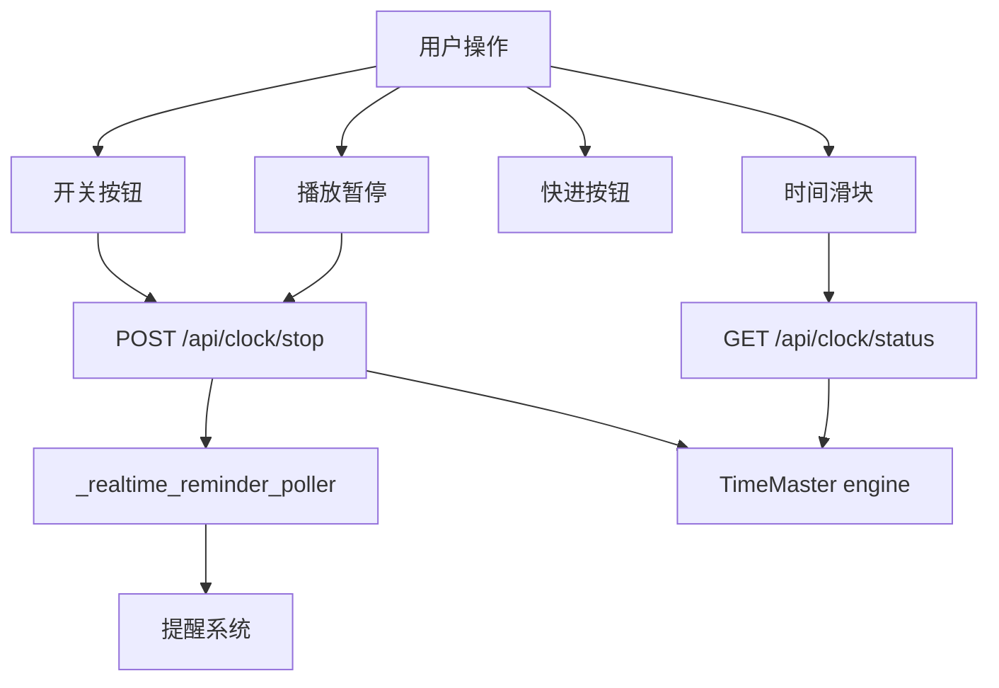
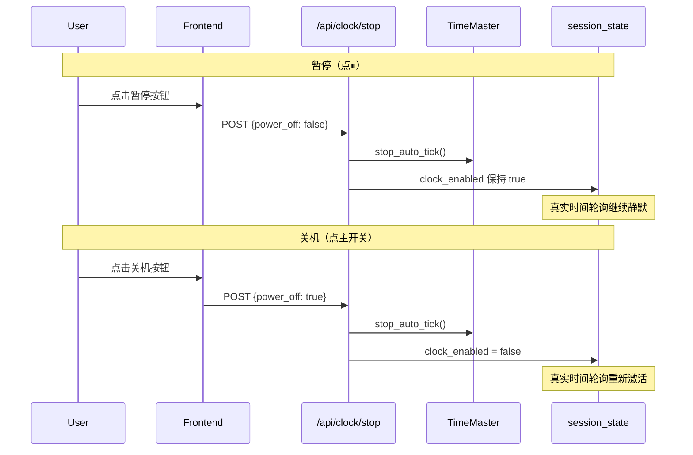
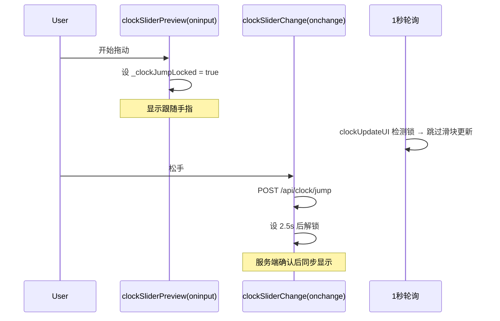

# Design Document

## Overview
**Purpose**: 修正虚拟时间控制台的四个行为缺陷，使虚拟时钟开关只改变时间源而不影响出行计划、滑块拖动不被轮询覆盖、暂停与关机状态正确分离、真实时间与虚拟时间提醒互斥。

**Users**: 沙盒演示操作者（通过虚拟时钟控制台操作时间、观察提醒行为）。
**Impact**: 删除 `_rescheduleWithVirtualTime()` 的三处调用、修复滑块 oninput 锁、为 `/api/clock/stop` 增加 `power_off` 参数区分暂停与关机、在真实时间轮询中增加 `clock_enabled` 判断。

### Goals
- 虚拟时钟开关/滑块跳转/快进不再触发出行计划重排
- 拖动滑块过程中显示值不被 1 秒轮询覆盖
- 暂停按钮只停定时器不改 `clock_enabled`，关机才设 `clock_enabled=false`
- 真实时间提醒轮询在虚拟时钟开启时静默

### Non-Goals
- 不重构 `_rescheduleWithVirtualTime` 函数本身（保留以备未来 PlanB 场景使用）
- 不修改 `time_master.py` 的任何逻辑
- 不修改 `task_reminder_skill.py` 的提醒管线
- 不改变出行计划的排程算法

## Boundary Commitments

### This Spec Owns
- `index.html` 中时钟操作后的行为（是否触发排程重算）
- `index.html` 中滑块 oninput/onchange 的锁定时机
- `server.py` 中 `/api/clock/stop` 的 `clock_enabled` 设置逻辑
- `server.py` 中 `_realtime_reminder_poller` 的激活条件

### Out of Boundary
- 出行计划排程算法（`/api/replan` 端点及 `main.py` 排程逻辑）
- `time_master.py` 的自动走时核心循环
- `task_reminder_skill.py` 的提醒状态机与催促判定
- SSE 推送通道架构

### Allowed Dependencies
- `server.py` — 可修改 `/api/clock/stop` 路由逻辑和 `_realtime_reminder_poller`
- `index.html` — 可修改 `clockTogglePower`、`clockSliderChange`、`clockFastForward`、`clockSliderPreview`、`clockTogglePlay`

### Revalidation Triggers
- `/api/clock/stop` 参数签名变更 → 前端所有调用 `/api/clock/stop` 的代码需复查
- `_realtime_reminder_poller` 行为变更 → 依赖该线程的任何测试场景需重新验证
- `_clockJumpLocked` 锁定时机变更 → 滑块交互体验需手动验证

## Architecture

### Existing Architecture Analysis
虚拟时钟相关的前后端数据流：

```
[index.html]
  clockTogglePower()    → POST /api/clock/init + /api/clock/stop
  clockTogglePlay()     → POST /api/clock/start 或 clockStop()
  clockSliderChange()   → POST /api/clock/jump
  clockSliderPreview()  → 仅前端显示更新（oninput）
  clockFastForward()    → POST /api/clock/offset
  clockStop()           → POST /api/clock/stop
  1秒轮询               → GET /api/clock/status + /api/clock/events

[server.py]
  /api/clock/stop       → time_master.stop_auto_tick() + 设 clock_enabled
  _realtime_reminder_poller → 独立线程，每 30s 用真实时间扫 schedule_nodes
```

### Architecture Pattern & Boundary Map



**Key Decisions**: 
- 暂停与关机在 `/api/clock/stop` 通过 `power_off` 参数区分
- 滑块在 `oninput` 阶段就设锁（之前仅在 `onchange` 阶段设锁导致拖的过程中被覆盖）
- 删除 `_rescheduleWithVirtualTime()` 调用而非删除函数本身，PlanB 执行仍可使用

### Technology Stack

| Layer | Choice / Version | Role in Feature | Notes |
|-------|------------------|-----------------|-------|
| Frontend | HTML5 + vanilla JS | 修改 `index.html` 中 4 个函数 | `clockTogglePower`, `clockSliderChange`, `clockSliderPreview`, `clockFastForward` |
| Backend | Python 3.9+ Flask | 修改 `server.py` 中 2 个函数 | `/api/clock/stop`, `_realtime_reminder_poller` |

## File Structure Plan

### Modified Files
- `index.html` — 删除 3 处 `_rescheduleWithVirtualTime()` 调用；在 `clockSliderPreview`（oninput）中设置 `_clockJumpLocked`；`clockTogglePlay`/`clockTogglePower` 调用 `/api/clock/stop` 时传 `power_off` 参数
- `server.py` — `/api/clock/stop` 接收 `power_off` 参数控制 `clock_enabled` 赋值；`_realtime_reminder_poller` 循环体开头增加 `clock_enabled` 判断提前 continue

## System Flows

### 暂停 vs 关机分离



### 滑块拖动锁定



## Requirements Traceability

| Requirement | Summary | Components | Interfaces | Flows |
|-------------|---------|------------|------------|-------|
| 1.1-1.4 | 虚拟时钟操作不触发出行计划重排 | `clockTogglePower`, `clockSliderChange`, `clockFastForward` | — | — |
| 2.1-2.3 | 滑块拖动时显示不被轮询覆盖 | `clockSliderPreview`, `clockSliderChange`, `clockUpdateUI` | `_clockJumpLocked` | 滑块拖动锁定 |
| 3.1-3.4 | 暂停与关机状态分离 | `/api/clock/stop` (server), `clockTogglePlay`, `clockTogglePower` | `power_off` 参数 | 暂停 vs 关机分离 |
| 4.1-4.4 | 真实时间与虚拟时间提醒互斥 | `_realtime_reminder_poller` | `clock_enabled` | 暂停 vs 关机分离 |

## Components and Interfaces

### 前端: 虚拟时钟操作函数

| Component | Domain/Layer | Intent | Req Coverage | Key Dependencies | Contracts |
|-----------|--------------|--------|--------------|------------------|-----------|
| `clockTogglePower` | UI/Control | 开关机，传 `power_off` 参数 | 1.1, 3.2 | `/api/clock/stop` (P0) | API |
| `clockSliderPreview` | UI/Input | 滑块拖动中加锁防覆盖 | 2.1 | `_clockJumpLocked` (P0) | State |
| `clockSliderChange` | UI/Input | 跳转后不解锁等 2.5s | 1.2, 2.2 | `/api/clock/jump` (P0) | API |
| `clockFastForward` | UI/Control | 快进不重排 | 1.3 | `/api/clock/offset` (P0) | API |

#### `clockTogglePower` 修改

| Field | Detail |
|-------|--------|
| Intent | 开机时删除 `_rescheduleWithVirtualTime()` 调用；关机时传 `power_off: true` |
| Requirements | 1.1, 1.4, 3.2 |

**API Contract 变更**:
```javascript
// 关机时
clockFetch('POST', '/api/clock/stop', {power_off: true})
// 暂停时（clockStop 函数）
clockFetch('POST', '/api/clock/stop', {power_off: false})
// 或省略参数兼容旧行为（默认 power_off: false）
```

#### `clockSliderPreview` 修改

| Field | Detail |
|-------|--------|
| Intent | 在 oninput 事件中（而非 onchange）设置 `_clockJumpLocked = true`，拖的过程中就锁住 |
| Requirements | 2.1 |

**修改点**: 在 `clockSliderPreview(val)` 函数体中追加 `_clockJumpLocked = true;`。不设解锁定时器（由 `clockSliderChange` 的 2.5s 定时器负责解锁）。

### 后端: 虚拟时钟 API

| Component | Domain/Layer | Intent | Req Coverage | Key Dependencies | Contracts |
|-----------|--------------|--------|--------------|------------------|-----------|
| `/api/clock/stop` | API/Route | 区分暂停 vs 关机 | 3.1, 3.2 | `session_state` (P0) | API |
| `_realtime_reminder_poller` | Background/Thread | 虚拟时钟开启时静默 | 4.1, 4.2 | `session_state` (P0) | State |

#### `/api/clock/stop` API Contract

| Method | Endpoint | Request | Response | Errors |
|--------|----------|---------|----------|--------|
| POST | `/api/clock/stop` | `{power_off?: bool}` 默认 false | `{status: "STOPPED", virtual_time: "HH:MM"}` | — |

**修改逻辑**:
```python
@app.route("/api/clock/stop", methods=["POST"])
def clock_stop():
    data = request.get_json() or {}
    power_off = data.get("power_off", False)
    if power_off:
        session_state["clock_enabled"] = False
    # 暂停时不改 clock_enabled
    tm = time_master.get_master()
    tm.stop_auto_tick(_CLOCK_SESSION_ID)
    ...
```

#### `_realtime_reminder_poller` 修改

| Field | Detail |
|-------|--------|
| Intent | 虚拟时钟开启时跳过真实时间检查 |
| Requirements | 4.1 |

**修改点**: 在 `while True:` 循环体开头（`_time.sleep(30)` 之前）增加：
```python
if session_state.get("clock_enabled"):
    _time.sleep(30)
    continue
```

## Testing Strategy

### 手动验证

1. **Req 1.1-1.4**: 设好出行计划 → 开启虚拟时钟 → 确认时间线不变；拖滑块 → 确认时间线不变；快进 → 确认时间线不变
2. **Req 2.1-2.3**: 开启虚拟时钟 → 拖动滑块过程中观察显示是否跟随手指，不被轮询弹回
3. **Req 3.1-3.4**: 开机 → 点 ▶ 开始走时 → 点 ⏸ 暂停 → 确认虚拟时钟仍处于开机状态（面板可操作、提醒由虚拟时间驱动）；关机 → 确认面板变灰
4. **Req 4.1-4.4**: 虚拟时钟关闭时设提醒（当前真实时间+1分钟）→ 1 分钟后弹窗；虚拟时钟开启时等真实时间到 → 不弹窗；拖滑块到提醒时间 → 弹窗
